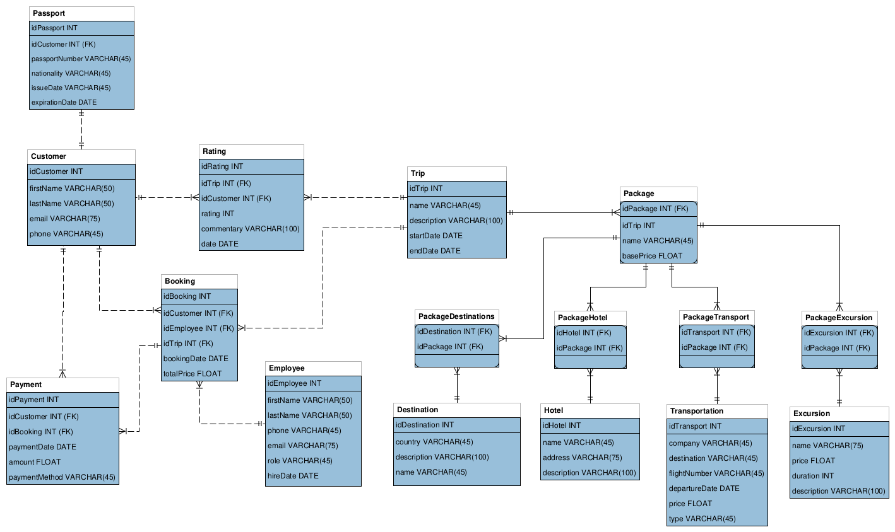

## Diagram

## Relations

## 1:M

- **Customer ↔ Booking**: One Customer can have many Booking entries but at the same time a booking belongs to only a single customer.
 -  **Trip ↔ Package**: One Trip can have many Package entries. A package represents services that are associated with a trip, often combining hotel, transportation (flights),etc into a single offering at a specific price.
 - **Employee ↔ Booking**: One Employee can process many Booking entries.
 - **Booking ↔ Payment**: One Booking can have many Payments (depending on whether the payment is split into multiple transactions).

## M:N
-   **Package ↔ Hotel**: A package can include multiple hotels, and a hotel can be part of multiple packages.
-   **Package ↔ Destination**: A package can include multiple destinations, and a destination can be part of multiple packages.
-   **Package ↔ Transport**: A package can include multiple transportation options, and a transport can be part of multiple packages.
-   **Package ↔ Excursion**: A package can include multiple excursions, and an excursion can be offered in multiple packages.

